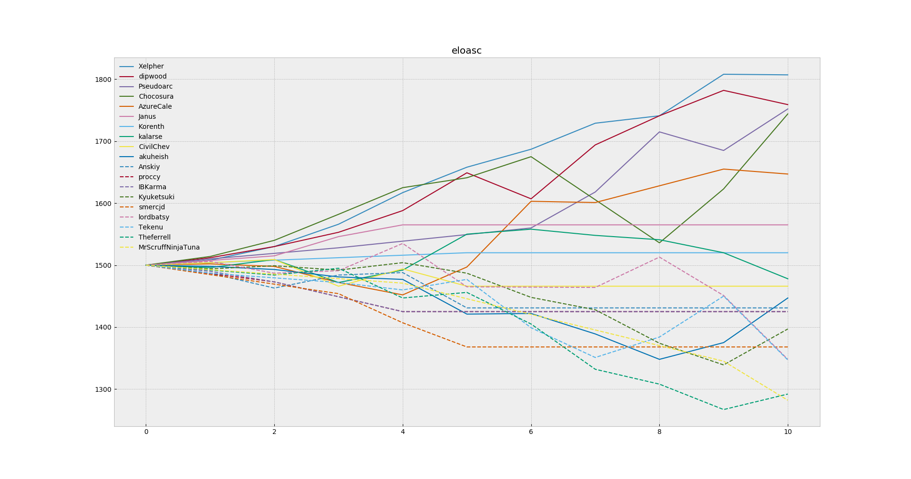
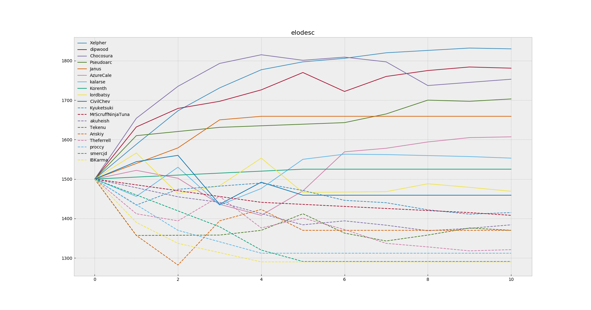
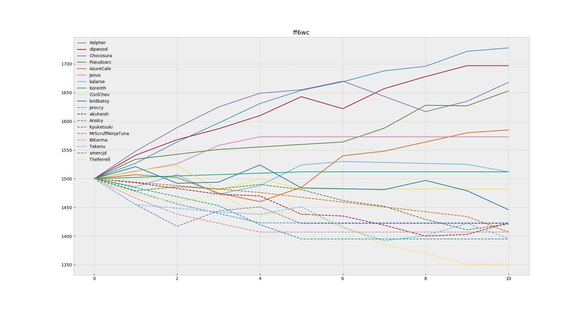
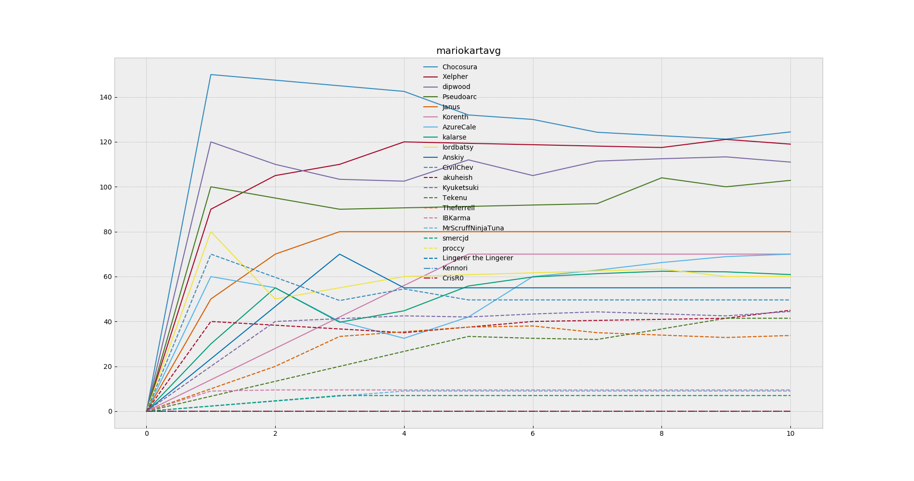
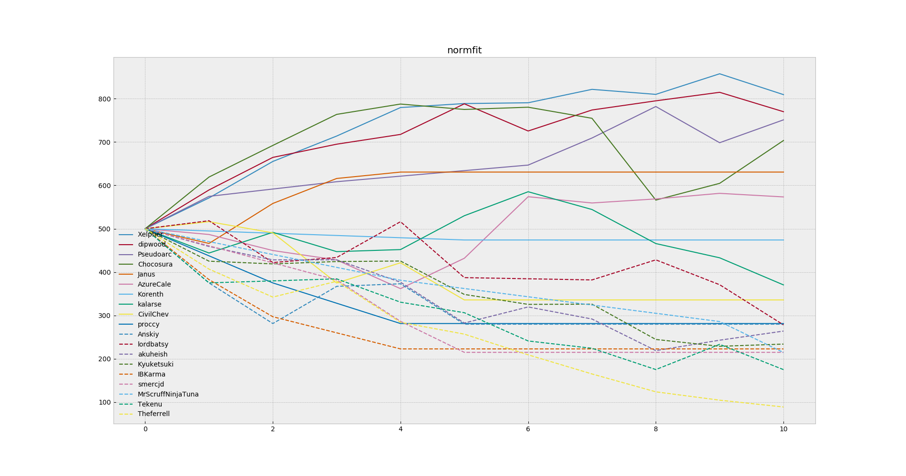

Usage:

`python3 cmdline.py --help` should tell you what you need to know hopefully

Current race scoring logic:

Graphs using different logics:

elo: simple Multiplayer-ELO, starting at 1500

elohighknum: like elo, but instead of K = 32/number of players, use 128/number of players

eloasc: like elo/elohighknum, but start at K=32/n then 64/n, etc. (K=32 * racenum / number of players)

elodesc: like elodesc, but in reverse. use 32 * (10 - race num), or 32 * (number of races - race number) if more than 10

eloten: like elo, but count 10th-and-greater places as all tied for 10th

ff6wc: like elo, but multiply elo changes by 3 and round all elo change values together, rather than individually

f1: like formula 1 scoring (as described by Tekenu)

mariokart: places get a given score resembling Mario Kart; rank is the sum

mariokartavg: like mariokart, but average the scores rather than summing them

simpleavg: like mariokartavg, but max score is total # of players in tournament, 2nd is that minus 1, etc.

rasteradjusted: like the current logic, but shift and multiply the range of 'expected' values to the range 10-100 (where the 'actual' values end up)

raster1500: like the current logic, but start at 1500

rasterfantasy: (obsolete for now) the "fantasy ladder rankings" as they were originally implemented

newfantasy: new experimental "fantasy" rankings:

newfantasy2: new experimental "fantasy" rankings, take 2:

normfit: each week, fit finish times to a scipy.stats.skewnorm distribution; scores are multiplied percentiles. overall score is an exponentially weighted moving average with a starting value corresponding to 50th percentile and (for now) an alpha of 0.1

